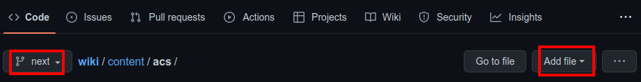
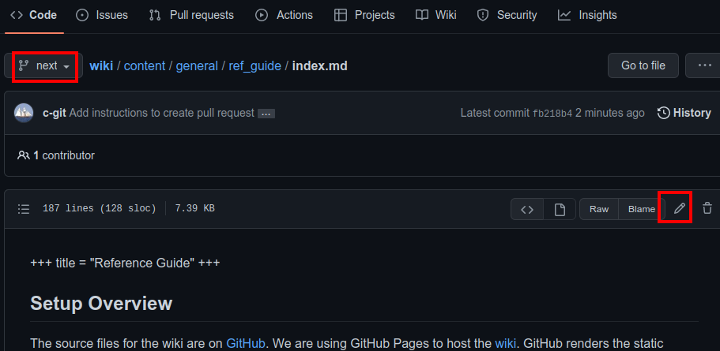

+++
title = "Reference Guide"
+++

## Setup Overview

The source files for the wiki are on [GitHub](https://github.com/LASSAT-YU/wiki/tree/next).
We are using GitHub Pages to host the [wiki](@/_index.md).
GitHub renders the static website at the root of the `gh-pages` branch.
This is the target branch for the build script that we are using.
We are using a static site generator named [Zola](https://www.getzola.org/) to generate the static html from templates
and markdown files.
The actual wiki [content][content] is written in markdown files with a front matter section that must be placed at the
top of
the file.
We only need to set the page title in that section.
The front matter starts with a line of three plus signs and ends the same way, `+++`.
Followed by the content of the page.
It would look something like:

```
+++
title = "Title goes here"
+++

And content goes here in markdown format
```

## Content Structure

The structure is very simple, each folder inside the [content][content] folder represents a subsystem.
Each .md file inside those folders defines a page.
The HTML templates are part of the theme and can be found in the "themes" folder.
You will not normally need to make any modifications to these.
If you do think a change is needed to the template or anything other than the content please open an issue on
our [repo](https://github.com/LASSAT-YU/wiki/issues) or talk to us about it in our [discord server][discord].

## Markdown

Zola and by extension this Wiki uses [CommonMark](https://commonmark.org/).
CommonMark has very good reference material on their site.
For getting started quickly or easy reference they have [Learn Markdown in 60 Seconds](https://commonmark.org/help/) and
if you are new to markdown or want a more complete
tutorial they have a [10 Minute Markdown Tutorial](https://commonmark.org/help/tutorial/).
The tutorial is very good.
It is interactive, and you get to try the content and get feedback in realtime.
It's also good to get more detail on a particular aspect of markdown, by using the index on the right side in during the
tutorial.

### Collapsable sections

Source: <https://gist.github.com/pierrejoubert73/902cc94d79424356a8d20be2b382e1ab>

Example:

<details>
  <summary>Click to expand!</summary>

Detailed body shows when you click.

Lorem ipsum dolor sit amet, consectetur adipiscing elit. Vestibulum enim lorem, placerat sed vestibulum a, pellentesque
at leo. Vivamus tincidunt nisi massa, nec pellentesque diam mollis vel. Vestibulum turpis mauris, placerat id lectus ac,
varius imperdiet libero. Ut tortor lorem, scelerisque eu elit vitae, eleifend gravida justo. Cras risus est, maximus non
dapibus quis, placerat ullamcorper diam. Ut vitae justo purus. Donec enim dolor, sodales et tempor vehicula, rutrum
vitae eros. Praesent commodo urna vitae pretium venenatis. Praesent lectus est, finibus sed lobortis at, finibus sit
amet velit. Maecenas varius tincidunt neque, sed ultricies lectus cursus ut. Phasellus auctor fermentum venenatis.
Vestibulum ante ipsum primis in faucibus orci luctus et ultrices posuere cubilia curae; Phasellus eu velit consectetur,
pretium ipsum eget, pharetra massa. Duis sed posuere nisl. Proin a pharetra sapien, sit amet sollicitudin nisi. Nulla
dolor nunc, interdum id convallis vitae, maximus ac elit.

Proin ullamcorper lorem id dui commodo hendrerit. Etiam vitae commodo ipsum. Aliquam placerat ex sed dolor eleifend, id
pulvinar lorem dictum. Duis in massa tortor. Maecenas leo quam, luctus at egestas ac, tincidunt a odio. Pellentesque
cursus mi egestas leo viverra egestas. Nulla quis velit sit amet tellus aliquet mollis sed sed justo. Vivamus interdum
porta ultricies. Nulla quis ex in arcu consequat auctor quis et ligula. Phasellus pellentesque nibh quis risus pretium
malesuada.
**Generated 2 paragraphs, 219 words, 1490 bytes of [Lorem Ipsum](https://www.lipsum.com/)**

</details>

**How to Structure**

```
<details>
   <summary>Click to expand!</summary>

   Detailed body shows when you click.
   
   ...
   
   ... 

</details>
```

**Two important rules:**

1. Make sure you have an **empty line** after the closing `</summary>` tag, otherwise the markdown/code blocks won't
   show correctly.
2. Make sure you have an **empty line** after the closing `</details>` tag if you have multiple collapsible sections.

## Zola

The Zola documentation can be found on their [website](https://www.getzola.org/documentation/getting-started/overview/).
Knowing the details of how it works is not required to make updates to this wiki.
Once you understand how to write [markdown](#markdown) then you should be fine.

## Summary

In summary what you need to know is:

- each subsystem has a section created for them which is represented by a folder inside the [content][content] folder.
- To add a new page create a file ending in `.md` in one of the subsystem folders.The top of the file must have the
  relevant front matter information as indicated in the [overview](#setup-overview).
- If you need to include images or other assets that need to be uploaded see the zola documentation
  regarding [asset collocation](https://www.getzola.org/documentation/content/overview/#asset-colocation). In their
  example the "research" folder corresponds to one of our subsystem folders.
- Feel free to reach out on [discord][discord] if you have any questions.

## Updating Wiki {#wiki-update}

The process can be completed entirely in your browser on github.com.

### Find subsystem to change

Find the folder for the subsystem that you want to make the update to.
The folders can be found in the [content][content] folder on our github.

### Make change

Once you have found the folder for the subsystem that you want to make the update to, you need to either add a new file
or edit an existing file.
For either option, ensure you are making changes against the `next` branch

#### Add new file



Click the `Add file` button.
Ensure the new filename ends in `.md`.
The top of the file must contain the front matter followed by the contents (See [overview](#setup-overview) for an
example).

#### Edit existing file



Select the file that you want to edit and click the edit icon.
Make any necessary additions or corrections.

### Preview Changes


Optionally you can make use of the preview feature offered by GitHub.
It will allow preview of most of the markdown features, but it will not for example remove things like the front matter
from the output and any other zola specific things.

### Submit changes made

Once you have created or edited a file you'll need to submit those changes for review.
Scroll all the way to the bottom of the page.


At this point you can put in a short description of the change made in this box.
If a longer message is needed please put a summary in this box and the longer description in the larger box bellow.


Once you are happy with the commit message click the `Propose changes` button.

At this point if you have more changes to make feel free to add/edit more files starting over
from [subsystem selection](#find-subsystem-to-change).

### Create Pull Request

### Start Pull Request


Near the top of the page you'll find the `Create pull request` button.
After ensuring that you are targeting the `next` branch click the `Create pull request` button.

### Submit Pull Request


Then you should only need to click `Create pull request` on the next screen to submit the request for review.

If you have any issues please reach out on [discord][discord].

[discord]: https://discord.gg/JBCdZRm

[content]: https://github.com/LASSAT-YU/wiki/tree/next/content
